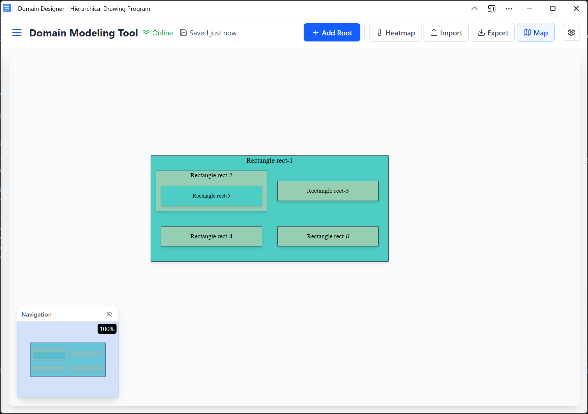

<div align="center">
  <h1>🎨 Domain Designer</h1>
  <p><strong>A powerful React+TypeScript application for creating domain models and hierarchical diagrams with intelligent constraint-based layout</strong></p>
  
  <p>
    <a href="https://thomasrohde.github.io/domain-designer/"><strong>🚀 Live Demo</strong></a>
    •
    <a href="https://thomasrohde.github.io/domain-designer/viewer?url=https%3A//thomasrohde.github.io/domain-designer/test-models/sample-diagram.json"><strong>🔗 Try URL Viewer</strong></a>
    •
    <a href="#features"><strong>Features</strong></a>
    •
    <a href="#getting-started"><strong>Getting Started</strong></a>
    •
    <a href="#usage"><strong>Usage</strong></a>
    •
    <a href="#contributing"><strong>Contributing</strong></a>
  </p>

  

  <div style="max-width: 700px; margin: 20px auto; padding: 20px; background: linear-gradient(135deg, #667eea 0%, #764ba2 100%); border-radius: 15px; color: white; text-align: center;">
    <h3 style="margin: 0 0 15px 0; font-size: 1.4em;">🏗️ The Enterprise Solution for Business Architecture</h3>
    <p style="margin: 0 0 15px 0; font-size: 1.1em; line-height: 1.4;">
      Design <strong>Business Capability Models</strong> and domain architectures with enterprise-grade security. 
      Create, share, and collaborate on hierarchical diagrams without compromising sensitive business data.
    </p>
    <div style="display: flex; justify-content: center; gap: 15px; flex-wrap: wrap; margin-top: 15px;">
      <span style="background: rgba(255,255,255,0.2); padding: 6px 12px; border-radius: 20px; font-size: 0.9em;">🔒 No Data Upload Required</span>
      <span style="background: rgba(255,255,255,0.2); padding: 6px 12px; border-radius: 20px; font-size: 0.9em;">🌐 URL-Based Sharing</span>
      <span style="background: rgba(255,255,255,0.2); padding: 6px 12px; border-radius: 20px; font-size: 0.9em;">📱 Works Offline</span>
      <span style="background: rgba(255,255,255,0.2); padding: 6px 12px; border-radius: 20px; font-size: 0.9em;">⚡ Enterprise Ready</span>
    </div>
  </div>

  <p>
    
    
    
    
    
  </p>
</div>

---

## ✨ Features

<table>
<tr>
<td>

### 🔧 Layout Algorithms
- **Grid Layout**: Traditional grid-based positioning with consistent spacing
- **Flow Layout**: Hierarchical flow with depth-based alternating orientations  
- **Mixed Flow Layout**: Intelligent space optimization (20-45% better efficiency)

### 🎯 Interactive Editing
- **Drag & Drop**: Intuitive rectangle positioning
- **Resize Handles**: Visual feedback for parent rectangles
- **Double-click Editing**: Quick label modifications
- **Context Menus**: Right-click for advanced options
- **Keyboard Navigation**: Arrow keys for precise positioning (1px/10px)

### ✨ Multi-Select Operations
- **PowerPoint-Style Selection**: Ctrl+Click and drag selection box
- **Bulk Alignment**: Align Left, Center, Right, Top, Middle, Bottom
- **Equal Distribution**: Horizontal/vertical spacing with perfect symmetry
- **Bulk Editing**: Change colors, labels, and properties for multiple rectangles
- **Group Operations**: Move, delete, and modify selections together

</td>
<td>

### 💾 Data Management
- **Save/Load**: Persist diagrams as JSON files
- **Auto-save**: Automatic IndexedDB persistence
- **Undo/Redo**: Full history management
- **Templates**: Load hierarchical templates from JSON
- **URL Viewer**: Share and view diagrams via direct URLs

### 🚀 Export & Sharing Options
- **HTML**: Interactive web documents with zoom/pan
- **SVG**: Scalable vector graphics
- **JSON**: Raw diagram data with URL sharing capabilities
- **Mermaid**: Diagram notation for documentation
- **URL Sharing**: View any JSON diagram directly via URL

</td>
</tr>
</table>

### 📱 Progressive Web App
- **📲 Installable**: Desktop installation on Windows, macOS, Linux
- **🌐 Offline Support**: Works without internet connection
- **💾 Auto-save**: Automatic IndexedDB-based persistence
- **⚡ Instant Loading**: Service worker caching for fast startup

## 🚀 Getting Started

### 📋 Prerequisites

- **Node.js** 20+ 
- **npm** or **yarn**

### ⚡ Quick Start

```bash
# Clone the repository
git clone https://github.com/ThomasRohde/domain-designer.git
cd domain-designer

# Install dependencies
npm install

# Start development server
npm run dev

# Open http://localhost:5173 in your browser
```

### 🛠️ Available Scripts

| Script | Description |
|--------|-------------|
| `npm run dev` | Start development server |
| `npm run build` | Build for production |
| `npm run preview` | Preview production build |
| `npm run typecheck` | Run TypeScript type checking |
| `npm run lint` | Run ESLint |

### 🏗️ Tech Stack

<div align="center">
  
  
  
  
</div>

**Core Technologies:**
- **React 19** with TypeScript for robust UI development
- **Vite** for lightning-fast development and building
- **Tailwind CSS** for utility-first styling
- **Lucide React** for beautiful icons
- **html2canvas** for high-quality export functionality
- **pako** for efficient compression
- **IndexedDB (idb)** for client-side data persistence

## 📖 Usage

### 🎯 Creating Your First Diagram

1. **🔰 Add Root Rectangle**: Click "Add Root" to create your first top-level rectangle
2. **🌳 Build Hierarchy**: Select any rectangle and click "Add Child" to create nested elements
3. **✏️ Edit Labels**: Double-click any rectangle to modify its label
4. **🎨 Customize**: Use the settings panel to adjust colors, fonts, and layout algorithms

### ⚙️ Layout Algorithm Configuration

<details>
<summary><strong>🔧 Global Settings</strong></summary>

- **Open Settings**: Click the ⚙️ settings icon in the toolbar
- **Choose Algorithm**: Select between Grid, Flow, and Mixed Flow layouts
- **Configure Appearance**: 
  - Adjust margin and label spacing
  - Set fixed dimensions for leaf nodes
  - Customize fonts, sizes, and border styles
  - Real-time preview of changes

</details>

### 🖱️ Interaction Guide

| Action | Method | Description |
|--------|--------|-------------|
| **Edit Label** | Double-click | Quick text editing |
| **Move Rectangle** | Drag | Reposition root rectangles |
| **Resize** | Drag corner handle | Adjust parent rectangle size |
| **Context Menu** | Right-click | Access advanced options |
| **Precise Movement** | Arrow keys | 1px precision movement |
| **Fast Movement** | Shift + Arrow keys | 10px quick movement |

### 🔐 Manual Positioning & Lock Controls

For advanced positioning control:

1. **🔓 Unlock**: Select a parent rectangle and click the unlock icon
2. **🎯 Move Children**: Use arrow keys to position child rectangles manually
3. **🔒 Lock as-is**: Click the lock icon to preserve exact dimensions and positions

#### 🏗️ Hierarchical Lock Protection

When you lock a rectangle "as-is":
- **🔒 Parent Protection**: The selected rectangle maintains its exact dimensions
- **🛡️ Cascade Protection**: ALL descendants (children, grandchildren, etc.) are automatically locked
- **🚫 Dimension Immunity**: Protected rectangles ignore global fixed width/height setting changes
- **✅ Position Updates**: Layout positioning still works, but dimensions remain fixed
- **🔓 Unlock Cascade**: Unlocking a parent automatically unlocks all its descendants

> **💡 Pro Tip**: Use "Lock as-is" to preserve imported diagram layouts or freeze sections while adjusting others. The hierarchical protection ensures entire subtrees maintain their exact appearance.

### 🎯 Multi-Select Operations

<div align="center">
  
  
  
</div>

Bring PowerPoint-style efficiency to your diagrams with advanced multi-select operations!

#### 🖱️ Selection Methods

| Method | Description | Visual Feedback |
|--------|-------------|-----------------|
| **Ctrl+Click** | Toggle individual rectangles in/out of selection | Blue selection borders with count badges |
| **Drag Selection** | Draw selection box on empty canvas area | Dashed selection rectangle |
| **Ctrl+A** | Select all sibling rectangles at same level | Instant multi-select of valid rectangles |

#### 🎯 PowerPoint-Style Context Menu

Right-click on any selected rectangle to access the multi-select context menu:

<table>
<tr>
<td width="50%">

**Alignment Operations**
- **Left/Center/Right**: Align to selection bounds
- **Top/Middle/Bottom**: Vertical alignment options
- **Grid Layout**: 3×2 button arrangement
- **Instant Application**: No confirmation required

</td>
<td width="50%">

**Distribution & Bulk Operations**
- **Distribute Horizontally**: Equal spacing between centers
- **Distribute Vertically**: Perfect symmetrical distribution
- **Bulk Color Change**: Apply color to all selected
- **Bulk Delete**: Remove entire selection with confirmation

</td>
</tr>
</table>

#### 📏 Advanced Alignment Features

<details>
<summary><strong>🎯 Alignment Algorithms</strong></summary>

**PowerPoint-Compatible Behavior:**
- **Boundary Alignment**: Left/Right/Top/Bottom align to selection extremes
- **Center Alignment**: Mathematical center of all selected rectangles
- **Grid Snapping**: All final positions snap to application grid
- **Property Preservation**: Colors, labels, and hierarchy maintained

**Distribution Logic:**
- **Equal Spacing**: Perfect gaps between rectangle centers
- **Boundary Preservation**: Outermost rectangles stay in place
- **Symmetrical Results**: Guaranteed equal spacing with grid alignment
- **Minimum 3 Rectangles**: Required for distribution operations

</details>

<div align="center">
  <details>
  <summary><strong>📊 Multi-Select Constraints & Rules</strong></summary>
  
  **Selection Rules:**
  - ✅ Same-level siblings only (identical parent)
  - ✅ Root rectangles can only group with other roots
  - ❌ Text labels excluded from multi-select operations
  - ❌ Cross-hierarchy selection not permitted
  
  **Operation Requirements:**
  - **Alignment**: Minimum 2 rectangles
  - **Distribution**: Minimum 3 rectangles  
  - **Bulk Movement**: Parent must have manual positioning enabled
  - **Layout Respect**: All operations work with Grid, Flow, and Mixed Flow algorithms
  
  </details>
</div>

### ⌨️ Keyboard Shortcuts

<table>
<tr>
<td>

**File Operations**
- `Ctrl+S` - Save diagram
- `Ctrl+O` - Load diagram

**Editing**
- `Ctrl+Z` - Undo
- `Ctrl+Y` / `Ctrl+Shift+Z` - Redo
- `Delete` - Remove selected rectangle(s)
- `Escape` - Cancel operation / Clear selection

**Multi-Select** ✨
- `Ctrl+A` - Select all siblings
- `Ctrl+Click` - Toggle selection
- `Delete` - Bulk delete with confirmation
- `Arrow Keys` - Bulk movement (when allowed)

</td>
<td>

**Navigation**
- `Arrow Keys` - Move 1px (precision)
- `Shift+Arrow Keys` - Move 10px (fast)

**Special**
- Works for root rectangles always
- Works for children when parent is unlocked
- Moving parent moves all children together

**Multi-Select Movement** ✨
- `Arrow Keys` - Move entire selection together
- `Shift+Arrow Keys` - Fast bulk movement (10px)
- Maintains relative positions during movement
- Automatic collision detection and prevention

</td>
</tr>
</table>

### 📤 Export Your Work

<div align="center">
  
  
  
  
</div>

| Format | Best For | Features |
|--------|----------|----------|
| **HTML** | Web sharing | Interactive zoom/pan, standalone document |
| **SVG** | High-quality prints | Vector graphics, infinite scalability |
| **JSON** | Backup/sharing | Raw data, version control friendly, URL sharing |
| **Mermaid** | Documentation | Code-based diagrams, GitHub integration |

### 🌐 URL-Based Diagram Sharing

Share your exported JSON diagrams instantly with the URL viewer:

```
https://yourdomain.com/viewer?url=https://example.com/path/to/diagram.json
```

**Features:**
- 📖 **Read-only viewing** of any publicly accessible JSON diagram
- 🔗 **Direct URL sharing** - no uploads or accounts needed  
- ✏️ **"Editor" button** - import diagram directly into the main application
- 🌍 **Universal access** - works with any web-hosted JSON file
- 🔒 **No data storage** - diagrams load directly from the provided URL

**Example Usage:**
```bash
# Export your diagram to JSON
# Upload to GitHub, Gist, or any web server
# Share the viewer URL:
/viewer?url=https://raw.githubusercontent.com/user/repo/main/diagram.json
```

**🎯 Try It Now:**
<div align="center">
  <a href="https://thomasrohde.github.io/domain-designer/viewer?url=https%3A//thomasrohde.github.io/domain-designer/test-models/sample-diagram.json">
    
  </a>
</div>

Click the link above to see the URL viewer in action with a live sample diagram. Use the "Editor" button to import and modify it!

### 📋 Template System

Accelerate your workflow with hierarchical templates:

```json
[
  {
    "id": "root-1",
    "name": "Business Architecture",
    "description": "Top-level business domain",
    "parent": null
  },
  {
    "id": "child-1",
    "name": "Business Processes",
    "description": "Core business processes",
    "parent": "root-1"
  }
]
```

**Template Features:**
- 📁 **Load from JSON**: Import structured hierarchies instantly
- 🎨 **Auto-coloring**: Hierarchy-based color coding
- 🌳 **Interactive Tree**: Browse and select nodes visually
- 🔄 **Partial Import**: Insert specific branches onto canvas

## 📱 Progressive Web App

<div align="center">
  
  
  
</div>

### 🏠 Installation

<table>
<tr>
<td width="50%">

**Desktop Experience**
- 🖥️ **Native-like**: Runs in dedicated window
- 🚀 **Fast Launch**: Start from desktop/menu
- 💾 **Offline Ready**: Works without internet
- 🔄 **Auto-sync**: Seamless data synchronization

</td>
<td width="50%">

**How to Install**
1. Open app in Chrome/Edge
2. Look for "Install" button in address bar
3. Click "Install Domain Designer"
4. Launch from desktop/start menu

</td>
</tr>
</table>

### 🌐 Offline Capabilities

| Feature | Description |
|---------|-------------|
| **Service Worker** | Caches app for instant loading |
| **IndexedDB** | Local data persistence |
| **Auto-save** | Real-time diagram saving |
| **Offline Indicator** | Network status display |
| **Background Sync** | Sync when connection restored |

### 📊 Status Indicators

The toolbar shows your connection and save status:
- 🟢 **Online/Offline**: Current network state
- 💾 **Auto-save**: Last saved timestamp
- ✅ **Saved**: Confirmation of data persistence

## 🏗️ Technical Architecture

<div align="center">
  
  
  
</div>

### 🧩 Core Components

| Component | Responsibility |
|-----------|---------------|
| `HierarchicalDrawingApp` | Main orchestrator and state management |
| `RectangleRenderer` | Handles rendering with proper z-indexing |
| `Canvas` | Drawing surface with pan/zoom capabilities |
| `Sidebar` + `PropertyPanel` | Settings and properties interface |
| `Toolbar` | Top navigation and action buttons |
| `ContextMenu` | Right-click interaction menu |
| `ExportModal` | Export configuration dialog |

### 🏭 Layout System Architecture

The application uses a **Factory Pattern** for pluggable layout algorithms:

```typescript
// Factory Pattern Implementation
interface ILayoutAlgorithm {
  calculateChildLayout(parent: Rectangle, children: Rectangle[]): Rectangle[];
  updateChildrenLayout(parent: Rectangle, children: Rectangle[]): void;
}

class LayoutAlgorithmFactory {
  static create(type: LayoutType): ILayoutAlgorithm {
    switch (type) {
      case 'grid': return new GridLayoutAlgorithm();
      case 'flow': return new FlowLayoutAlgorithm();
      case 'mixed': return new MixedFlowLayoutAlgorithm();
    }
  }
}
```

### 🎣 Hook-Based Architecture

Separation of concerns through custom hooks:

| Hook | Purpose |
|------|---------|
| `useRectangleManager` | Rectangle state and CRUD operations |
| `useCanvasInteractions` | Drag/drop, resize, and pan handling |
| `useAppSettings` | Global settings and layout preferences |
| `useUIState` | UI state management (modals, sidebar) |
| `useHistory` | Undo/redo functionality |
| `useAutoSave` | Automatic data persistence |

### 📊 Data Structure

```typescript
interface Rectangle {
  id: string;
  parentId?: string;
  x: number;
  y: number;
  w: number;
  h: number;
  label: string;
  color: string;
  category: RectangleCategory;
  type: 'root' | 'parent' | 'leaf';
}
```

## 🎯 Layout Algorithms

<div align="center">
  
  
  
</div>

### 🔲 Grid Layout Algorithm

<table>
<tr>
<td width="70%">

**Purpose**: Traditional grid-based positioning with consistent spacing

**Features**:
- 📐 Arranges children in structured grid patterns
- 📏 Consistent margin system with configurable spacing
- 🔢 Minimum parent size calculation
- ⚡ Optimized for structured diagrams

**Best For**: Organizational charts, structured data models

</td>
<td width="30%">

```
┌─────────────────┐
│ Parent          │
│ ┌─────┐ ┌─────┐ │
│ │ C1  │ │ C2  │ │
│ └─────┘ └─────┘ │
│ ┌─────┐ ┌─────┐ │
│ │ C3  │ │ C4  │ │
│ └─────┘ └─────┘ │
└─────────────────┘
```

</td>
</tr>
</table>

### 🌊 Flow Layout Algorithm

<table>
<tr>
<td width="70%">

**Purpose**: Hierarchical flow with depth-based alternating orientations

**Features**:
- 🔄 Alternates between ROW and COLUMN based on tree depth
- 🌳 Hierarchical positioning with intelligent spacing
- 📐 Dynamic orientation switching
- 🎯 Content-aware size calculations

**Best For**: Process flows, decision trees, hierarchical structures

</td>
<td width="30%">

```
┌─────────────────┐
│ Parent          │
│ ┌─────┐         │
│ │ C1  │         │
│ └─────┘         │
│ ┌─────┐         │
│ │ C2  │         │
│ └─────┘         │
└─────────────────┘
```

</td>
</tr>
</table>

### 🎨 Mixed Flow Layout Algorithm

<table>
<tr>
<td width="70%">

**Purpose**: Intelligent space optimization with adaptive layouts

**Features**:
- 🧠 Evaluates multiple layout configurations
- 📊 Automatic selection based on efficiency scoring
- 🎯 20-45% better space utilization
- 🔄 Adapts to content characteristics dynamically

**Best For**: Complex diagrams, mixed content, space-constrained layouts

</td>
<td width="30%">

```
┌─────────────────┐
│ Parent          │
│ ┌─────┐ ┌─────┐ │
│ │ C1  │ │ C2  │ │
│ └─────┘ └─────┘ │
│ ┌─────┐         │
│ │ C3  │         │
│ └─────┘         │
└─────────────────┘
```

</td>
</tr>
</table>

### 🎛️ Layout Management

- **`LayoutManager`**: Central orchestrator for all layout operations
- **`LayoutAlgorithmFactory`**: Factory for creating algorithm instances  
- **Dynamic Switching**: Change algorithms via global settings
- **Consistent Interface**: All algorithms implement `ILayoutAlgorithm`

## 🚀 Deployment

<div align="center">
  
  
  
</div>

This project features **fully automated deployment** to GitHub Pages:

### 🔄 Automated Pipeline
- **Trigger**: Every push to `main` branch
- **Build**: Vite optimized production build
- **Deploy**: Automatic GitHub Pages deployment
- **Live**: Instantly available at the live URL

### 🌍 Live Environment
- **URL**: [https://thomasrohde.github.io/domain-designer/](https://thomasrohde.github.io/domain-designer/)
- **CDN**: Global content delivery via GitHub Pages
- **HTTPS**: Secure connection with SSL certificate
- **Performance**: Optimized static assets with Vite

## 📄 License

<div align="center">
  
</div>

This project is licensed under the **MIT License** - see the [LICENSE](LICENSE) file for details.

---

<div align="center">
  <p>
    <strong>Made with ❤️ by <a href="https://github.com/ThomasRohde">Thomas Klok Rohde</a></strong>
  </p>
  <p>
    <a href="https://thomasrohde.github.io/domain-designer/">🚀 Try it now</a>
    •
    <a href="https://github.com/ThomasRohde/domain-designer/issues">🐛 Report Bug</a>
    •
    <a href="https://github.com/ThomasRohde/domain-designer/issues">💡 Request Feature</a>
  </p>
</div>